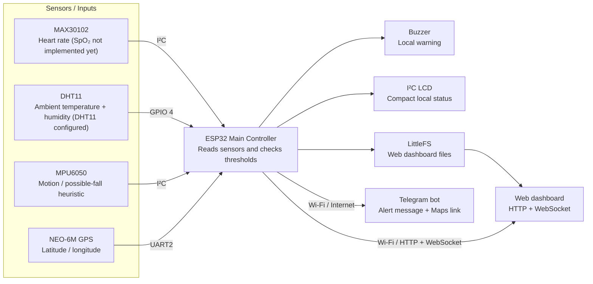

# System Architecture — Smart Wearable Health Monitoring for Soldiers

The reference architecture image belongs in this `docs/` folder, alongside this document. The README should link here so the architecture is easy to find from the repository home page.

## Architecture diagram

## Data flow
1. ESP32 reads MAX30102 optical samples for a tentative heart-rate estimate.
2. DHT11 measures **ambient** temperature and relative humidity, not body temperature.
3. MPU6050 acceleration/gyroscope data feeds a simple possible-fall heuristic.
4. GPS UART provides coordinates only while a recent fix is available.
5. LCD shows a compact local status.
6. LittleFS serves `index.html`, `style.css`, and `script.js`; WebSocket port 81 broadcasts telemetry. `/api/data` is a fallback.
7. Threshold changes or a possible fall can activate the buzzer and attempt a Telegram alert. Telegram messages use status icons, sensor labels, and a Google Maps link when GPS is available. A recovery message is attempted when alert conditions clear.

## Current prototype defaults
- Heart rate > 130 BPM or < 45 BPM when a reading is valid.
- DHT11 ambient temperature > **29 °C** (temporary threshold for the current DHT11 Telegram test).
- Relative humidity > 85%.
- Fall detection uses a simple impact/motion heuristic.

These are demonstration values, not medical recommendations. Tune and test in controlled conditions.

## Telegram setup
Copy `firmware/secrets.h.example` to `firmware/secrets.h`; enter Wi-Fi name/password and the replacement Telegram bot token/chat ID locally. The actual secrets file is ignored by Git. Telegram requires Wi-Fi internet access. The firmware applies a one-minute cooldown.

## Known limits
SpO₂ is not implemented and is explicitly shown as unavailable. MAX30102 heart-rate readings can be affected by movement and contact. Fall detection is a crude heuristic with false positives/negatives. GPS may not fix indoors. This is a prototype, not a medical device; do not rely on it for actual emergency response.
